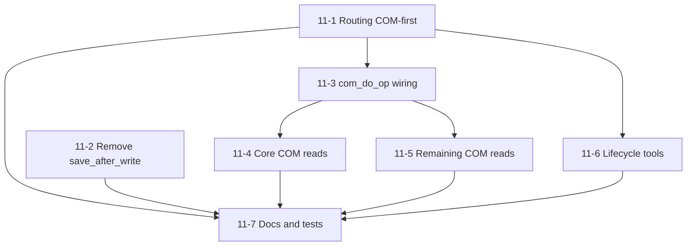

# Implementation roadmap — workbook transport routing

This roadmap decomposes `docs/specs/PRD-excel-mcp-transport-routing.md` into **epics and stories** under `docs/plan/transport-routing/`, aligned with `docs/architecture/target-architecture.md` and ADRs `docs/architecture/adr/`.

**Status (2026-04-27):** Epics **1–9** and **Epic 11** are **delivered** in code and operator docs. **Epic 9** ([cloud / SharePoint workbook locators for COM](Epics/Epic-9-sharepoint-and-cloud-workbook-locators-for-com.md)) is **delivered**. **Epic 8** (governed CI/CD, PyPI **excel-com-mcp**) is **delivered**; see [Epic-8](Epics/Epic-8-governed-ci-cd-pypi-and-release-pipelines.md). Transport epics **1–7** delivered per prior roadmap. **Epic 10** ([COM read-class tools and routing](Epics/Epic-10-com-read-class-tools-and-routing.md)) is **superseded** by **[Epic 11](Epics/Epic-11-com-first-session-and-lifecycle.md)** — Epic-10 and **Story-10-*** files remain **historical** (ADR 0007 opt-in / file-default reads); **current behavior** follows **[ADR 0008](../../architecture/adr/0008-com-first-default-and-file-lifecycle-tools.md)** and Epic-11 ([`CHANGELOG.md`](../../../CHANGELOG.md) **0.3.0**).

## Phasing (execution order)

| Phase | Epic | Summary |
|-------|------|---------|
| 1 | [Epic-1](Epics/Epic-1-tool-inventory-and-shared-workbook-operation-contract.md) | Tool inventory and shared workbook operation contract |
| 2 | [Epic-2](Epics/Epic-2-path-normalization-and-unified-allowlist.md) | Path normalization and unified allowlist *(delivered)* |
| 3 | [Epic-3](Epics/Epic-3-fileworkbookservice-facade-and-handler-consolidation.md) | `FileWorkbookService` façade and handler consolidation *(delivered)* |
| 4 | [Epic-4](Epics/Epic-4-routingbackend-and-open-workbook-detection-file-backed-execution.md) | `RoutingBackend`, injectable open-workbook detection, structured logs *(delivered)* |
| 5 | [Epic-5](Epics/Epic-5-operator-controls-and-mcp-tool-wiring.md) | Operator controls: env vars, tool params, handler wiring *(delivered)* |
| 6 | [Epic-6](Epics/Epic-6-com-packaging-executor-and-comworkbookservice-skeleton.md) | COM packaging, single-thread executor, `ComWorkbookService` skeleton *(delivered)* |
| 7 | [Epic-7](Epics/Epic-7-com-write-parity-edge-policies-save-workbook-and-release-hardening.md) | COM write parity, edge policies, `save_workbook`, docs, CI, manual checklist *(delivered)* |
| 8 | [Epic-8](Epics/Epic-8-governed-ci-cd-pypi-and-release-pipelines.md) | Governed CI/CD, reusable gates, manual packaging/publish, PyPI (**`excel-com-mcp`**) *(delivered)* |
| 9 | [Epic-9](Epics/Epic-9-sharepoint-and-cloud-workbook-locators-for-com.md) | SharePoint / `https` workbook locators for COM routing, URL allowlist, docs *(delivered)* |
| 10 | [Epic-10](Epics/Epic-10-com-read-class-tools-and-routing.md) | *(Historical — superseded by Epic-11; ADR 0007-era opt-in COM reads.)* |
| 11 | [Epic-11](Epics/Epic-11-com-first-session-and-lifecycle.md) | COM-first default routing, COM read parity, remove `save_after_write`, lifecycle tools, docs/tests *(delivered; **0.3.0**)* |

## Epic-11: COM-first session and lifecycle (delivered)

**Epic document:** [Epic-11 — COM-first session and lifecycle](Epics/Epic-11-com-first-session-and-lifecycle.md). **PyPI / version line:** **0.3.0** (see [`CHANGELOG.md`](../../../CHANGELOG.md)).

**Traces to:** [ADR 0008](../../architecture/adr/0008-com-first-default-and-file-lifecycle-tools.md), [COM-first workbook session design](../../architecture/com-first-workbook-session-design.md), [com-read-class-tools design](../../architecture/com-read-class-tools-design.md) (implementation parity), [ADR 0004](../../architecture/adr/0004-chart-pivot-com-parity-scope.md) (file-forced exceptions), [ADR 0005](../../architecture/adr/0005-com-strict-and-fallback-controls.md), [ADR 0006](../../architecture/adr/0006-cloud-workbook-locator-sharepoint-urls.md).

### Stories (summary)

| Story | Title |
|-------|--------|
| [11-1](Stories/Story-11-1-com-first-routing-read-write-and-file-forced.md) | COM-first routing for READ/WRITE, file fallback, V1_FILE_FORCED |
| [11-2](Stories/Story-11-2-remove-save-after-write-explicit-save-only.md) | Remove `save_after_write`; `save_workbook` only |
| [11-3](Stories/Story-11-3-com-do-op-wiring-all-read-handlers.md) | Wire `com_do_op` for all read-class handlers |
| [11-4](Stories/Story-11-4-com-read-range-with-metadata-and-core-reads.md) | COM read — `read_range_with_metadata` and core paths |
| [11-5](Stories/Story-11-5-remaining-com-read-parity-and-chart-pivot-exceptions.md) | Remaining COM read parity; chart/pivot documentation |
| [11-6](Stories/Story-11-6-lifecycle-create-open-close-excel-session.md) | Lifecycle: create, `excel_open_workbook`, close (save optional) |
| [11-7](Stories/Story-11-7-tests-readme-tools-md-operator-env-overhaul.md) | Tests, README, TOOLS.md, operator env |

### Dependency graph (logical)



**Rough effort (Epic-11):** **6–9 developer-weeks** total (see epic document for per-story ranges).

**Parallelization:** **11-1** and **11-2** can start together after kickoff; **11-3** follows **11-1**. **11-4** and **11-5** parallelize after **11-3**. **11-6** can overlap **11-4**/**11-5** once **11-1** is stable. **11-7** runs continuously and completes last.

**Supersedes Epic-10:** Epic-10 assumed **default file-backed reads** and **explicit COM read opt-in** ([ADR 0007](../../architecture/adr/0007-com-read-class-tools-routing.md)). **ADR 0008** inverts defaults and adds lifecycle tools; **Epic-11** is the active backlog.

## Architecture traceability

| Theme | Architecture source |
|-------|---------------------|
| Layering (`RoutingBackend`, services, path policy) | `docs/architecture/target-architecture.md` |
| Workbook vs MCP wire naming | `docs/architecture/adr/0001-workbook-transport-vs-mcp-wire-transport.md` |
| COM stack choice | `docs/architecture/adr/0002-com-automation-stack.md` |
| Read path + `save_workbook` | `docs/architecture/adr/0003-read-path-com-parity.md` (explicit save; defaults partly superseded by ADR 0008) |
| Chart/pivot v1 scope | `docs/architecture/adr/0004-chart-pivot-com-parity-scope.md` |
| Strict mode and fallback | `docs/architecture/adr/0005-com-strict-and-fallback-controls.md` |
| Baseline coupling | `docs/architecture/pre-fork-architecture.md` |
| CI/CD, PyPI, release gates | `docs/architecture/ci-cd-packaging-governance.md` |
| Versioning and changelog | `docs/architecture/release-versioning-policy.md` |
| Cloud workbook locators (SharePoint URLs, COM identity) | `docs/architecture/adr/0006-cloud-workbook-locator-sharepoint-urls.md` |
| COM read-class tools (historical opt-in draft) | `docs/architecture/adr/0007-com-read-class-tools-routing.md`, `docs/architecture/com-read-class-tools-design.md` |
| **COM-first default, lifecycle tools, remove `save_after_write` (current)** | **`docs/architecture/adr/0008-com-first-default-and-file-lifecycle-tools.md`**, **`docs/architecture/com-first-workbook-session-design.md`** |

## Validate planning artifacts

Using the **project-planning** skill’s `LintPlan.ts` (requires [Bun](https://bun.sh/)):

```bash
bun run LintPlan.ts --root <repo-root>
```

Run `LintPlan.ts` from the skill’s `scripts/` directory, passing this repository as `--root`.

## Related replan one-pager

[PLAN-COM-FIRST-REBASE.md](PLAN-COM-FIRST-REBASE.md) links ADR 0008 to Epic-11 for quick orientation.
